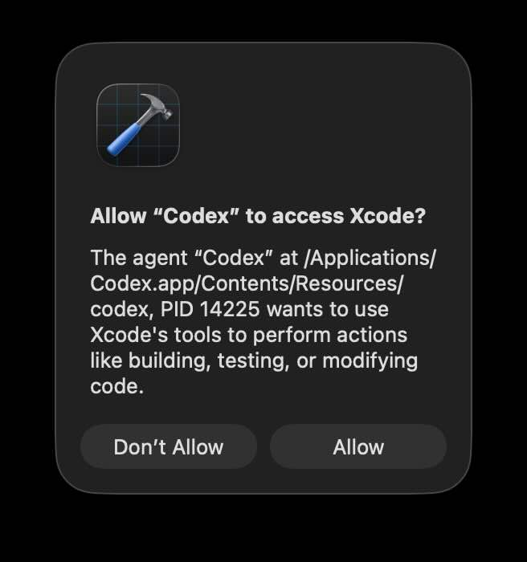

# xcode-cli

[English](./README.md)

对 [Xcode 26+ 官方 MCP 工具](https://developer.apple.com/xcode/mcp/) 的 CLI + Skill 封装 — 在终端或 AI 代理中构建、诊断、测试和预览 Xcode 项目。

| 痛点 | 解法 |
|------|------|
| AI 代理调用 Xcode MCP 时 TCC 弹窗反复弹出，无法记住授权 | 持久化 `mcp-proxy` 进程，macOS 只授权一次 |
| MCP 工具定义（20 个 ~5K tokens）占用每次对话上下文 | 封装为 Claude Code Skill，按需加载 |

## 详细说明

### 问题一：TCC 权限弹窗



使用 AI 代理（Claude Code、Codex、Cursor）调用 Xcode 26 MCP 工具时，macOS TCC 弹窗每隔数秒反复弹出，且因 CLI 进程 PID 不断变化而[永远无法记住授权](https://github.com/openai/codex/issues/10741)。

### 根本原因

每次 AI 代理调用 `xcrun mcpbridge` 时，macOS 看到的是一个新进程（新 PID），于是触发新的 TCC 授权弹窗。没有办法永久允许。

### 解决方案

本工具在代理和 Xcode 之间放置一个持久化的 `mcp-proxy` 进程。代理通过 HTTP 与它通信，macOS 只需授权**一次**。

```
Agent ──HTTP──▶ mcp-proxy（持久进程，固定 PID）──stdio──▶ xcrun mcpbridge ──▶ Xcode
                    ▲
              只需允许一次
```

### 问题二：节省 ~5K Tokens 上下文

MCP 工具定义（20 个工具 ~5K tokens）会加载到**每次对话**中，无论是否使用。将其封装为 [Claude Code Skill](https://docs.anthropic.com/en/docs/claude-code/skills) 后，上下文中仅保留 ~30 词的描述，完整工具文档按需加载。

## 前置条件

- **macOS** + **Xcode 26+**（自带 `xcrun mcpbridge`）
- **Node.js** 18+
- **[mcp-proxy](https://github.com/sparfenyuk/mcp-proxy)**（将 stdio MCP 桥接为 HTTP）
- **pm2**（保持 mcp-proxy 常驻）

## 快速开始

```bash
# 1. 安装依赖
uv tool install mcp-proxy   # 或: pip install mcp-proxy
npm install -g pm2

# 2. 克隆并安装 CLI
git clone https://github.com/dazuiba/xcode-cli.git
cd xcode-cli
npm link

# 3. 启动持久化代理
pm2 start xcode-mcp-proxy.config.cjs
pm2 save
```

TCC 弹窗出现时点击"允许"，此后不再弹出。

### 验证

```bash
# 确保 Xcode 已打开项目
xcode-cli XcodeListWindows
xcode-cli BuildProject --tab-identifier windowtab1
```

## AI 代理集成

### Claude Code（Skill 方式）

安装 skill，让 Claude Code 知道如何使用 `xcode-cli`：

```bash
mkdir -p ~/.claude/skills/xcode-cli
cp skills/xcode-cli/SKILL.md ~/.claude/skills/xcode-cli/SKILL.md
```

重启 Claude Code，skill 将以 `/xcode-cli` 形式可用。

### Claude Code（MCP server 方式）

如果偏好 MCP 方式（会在每次对话中加载 20 个工具定义）：

```json
{
  "mcpServers": {
    "xcode-proxy": {
      "type": "http",
      "url": "http://localhost:9876/mcp"
    }
  }
}
```

### Codex / 其他代理

任何能执行 bash 命令的代理都可以直接使用 `xcode-cli`。在 `AGENTS.md` 中添加：

````markdown
## Xcode Tools

使用 `xcode-cli` CLI 与 Xcode IDE 交互。先获取 `tab-identifier`：

```bash
xcode-cli XcodeListWindows
```

然后用于编译、诊断、测试和预览：

```bash
xcode-cli BuildProject --tab-identifier windowtab1
xcode-cli GetBuildLog --tab-identifier windowtab1 --severity error
xcode-cli XcodeRefreshCodeIssuesInFile --tab-identifier windowtab1 --file-path "path/to/file.swift"
xcode-cli RunAllTests --tab-identifier windowtab1
```

运行 `xcode-cli --help` 查看全部 20 个工具。
````

## 使用方法

```bash
xcode-cli <ToolName> [--param value ...]
```

大多数命令需要 `--tab-identifier`，先获取：

```bash
xcode-cli XcodeListWindows
```

### 可用工具（20 个）

| 类别 | 工具 |
|------|------|
| **构建与诊断** | `BuildProject`, `GetBuildLog`, `XcodeRefreshCodeIssuesInFile`, `XcodeListNavigatorIssues` |
| **文件操作** | `XcodeRead`, `XcodeWrite`, `XcodeUpdate`, `XcodeRM`, `XcodeMV`, `XcodeMakeDir`, `XcodeLS` |
| **搜索** | `XcodeGrep`, `XcodeGlob`, `DocumentationSearch` |
| **测试** | `GetTestList`, `RunAllTests`, `RunSomeTests` |
| **预览与执行** | `RenderPreview`, `ExecuteSnippet` |
| **工作区** | `XcodeListWindows` |

### 示例

```bash
# 编译并检查错误
xcode-cli BuildProject --tab-identifier windowtab1
xcode-cli GetBuildLog --tab-identifier windowtab1 --severity error

# 单文件快速诊断（无需完整编译）
xcode-cli XcodeRefreshCodeIssuesInFile --tab-identifier windowtab1 \
  --file-path "MyApp/Sources/ContentView.swift"

# 渲染 SwiftUI 预览
xcode-cli RenderPreview --tab-identifier windowtab1 \
  --source-file-path "MyApp/Sources/Views/HomeView.swift"

# 搜索 Apple 文档
xcode-cli DocumentationSearch --query "SwiftUI NavigationStack"

# 运行全部测试
xcode-cli RunAllTests --tab-identifier windowtab1
```

完整参数：`xcode-cli --help`

## 工作原理

```
AI Agent ──bash──▶ xcode-cli ──HTTP──▶ mcp-proxy ──stdio──▶ xcrun mcpbridge ──▶ Xcode IDE
```

| 组件 | 职责 |
|------|------|
| `xcrun mcpbridge` | Xcode 内置 MCP server（stdio 传输） |
| `mcp-proxy` | stdio → HTTP 桥接（端口 9876）；解决 TCC 的持久进程 |
| `xcode-cli` | 由 [mcporter](https://github.com/steipete/mcporter) 生成的 CLI 封装，将命令行参数转为 MCP 工具调用 |

## 重新生成 CLI

当 Xcode 新增 MCP 工具时：

```bash
npx mcporter generate-cli \
  --command "http://localhost:9876/mcp" \
  --output bin/xcode-cli.ts \
  --bundle bin/xcode-cli \
  --runtime node
```

## License

MIT
